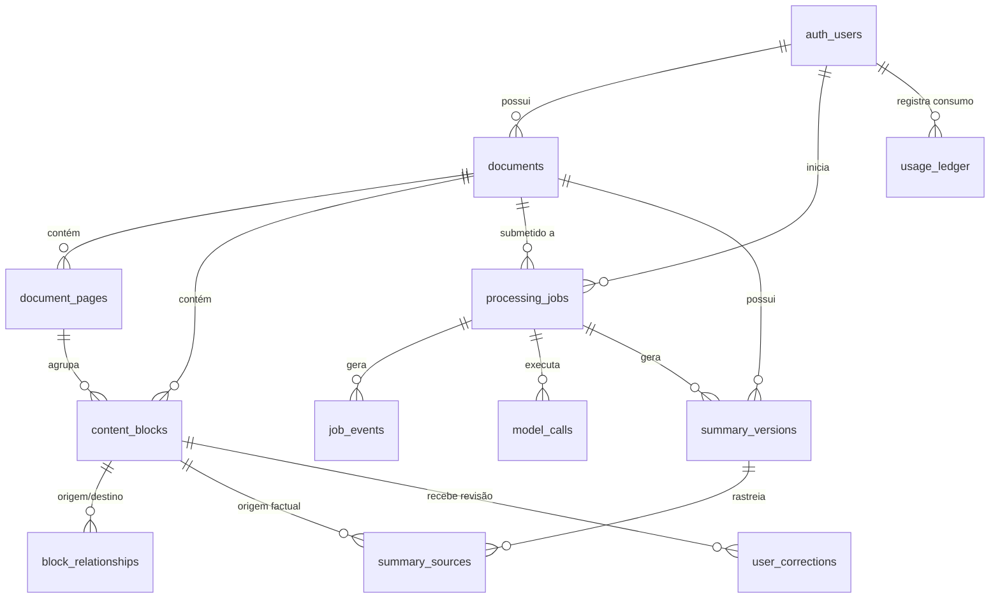

# Documentação do Schema de Banco de Dados e Persistência do ResumeX

Data: 24/07/2026
Versão: 2.0.0 (Comercial / Multi-tenant)
Provedor de Banco: **Supabase / PostgreSQL**

> Estado alvo da migration `202607240001_pipeline_persistence.sql`. Em
> 09/08/2026, o histórico remoto registra as migrations legadas e o hardening até
> `202607230001`; este schema V2 permanece pendente e ainda não está aplicado.
> No contrato atual, cada `processing_jobs.document_id` representa exatamente um
> documento. A ponte opt-in do servidor respeita esse limite e não persiste jobs
> multi-PDF; não use o campo para representar implicitamente um conjunto de PDFs.
> O resumo de um PDF usa `summary_versions.id = processing_jobs.id`, tornando a
> gravação final idempotente. `summary_sources` permanece inativa até os blocos do
> Document IR também terem persistência idempotente.

---

## 1. Visão Geral das Tabelas

A arquitetura de persistência do **ResumeX** suporta processamento resiliente de PDFs, rastreabilidade de blocos de conteúdo (Document IR), checkpoints de jobs, auditoria de consumo e isolamento multi-tenant via Row Level Security (RLS).

---

## 2. Detalhamento das Tabelas

### 2.1. `documents`
Armazena os metadados dos arquivos PDF submetidos pelos usuários.

| Campo | Tipo | Nulo | Descrição |
| --- | --- | --- | --- |
| `id` | `uuid` | Não | Chave primária (`gen_random_uuid()`) |
| `user_id` | `uuid` | Não | FK para `auth.users(id)` |
| `organization_id` | `uuid` | Sim | FK para organizações (se aplicável) |
| `original_name` | `text` | Não | Nome original do arquivo |
| `mime_type` | `text` | Não | Padrão: `application/pdf` |
| `size_bytes` | `bigint` | Não | Tamanho do arquivo em bytes |
| `sha256` | `text` | Não | Hash SHA-256 do arquivo original |
| `page_count` | `integer` | Não | Total de páginas |
| `status` | `text` | Não | `uploaded`, `processing`, `completed`, `failed` |
| `storage_path` | `text` | Não | Caminho no Supabase Storage |
| `retention_until` | `timestamptz` | Sim | Data de retenção/expiração |
| `created_at` | `timestamptz` | Não | Data de criação (`now()`) |
| `updated_at` | `timestamptz` | Não | Data de atualização (`now()`) |
| `deleted_at` | `timestamptz` | Sim | Soft delete |

---

### 2.2. `document_pages`
Registra informações de cada página do documento.

| Campo | Tipo | Nulo | Descrição |
| --- | --- | --- | --- |
| `id` | `uuid` | Não | Chave primária |
| `document_id` | `uuid` | Não | FK para `documents(id)` |
| `page_number` | `integer` | Não | Número da página (>= 1) |
| `width` | `double precision` | Não | Largura em pontos PDF |
| `height` | `double precision` | Não | Altura em pontos PDF |
| `rotation` | `integer` | Não | Rotação (0, 90, 180, 270) |
| `native_text_coverage` | `double precision` | Não | Cobertura de texto selecionável (0 a 1) |
| `raster_image_coverage` | `double precision` | Não | Cobertura de imagens raster (0 a 1) |
| `flags` | `jsonb` | Não | Array de flags (ex: `["has_handwriting"]`) |
| `processing_plan` | `jsonb` | Não | Plano de processamento visual/OCR |
| `raster_hash` | `text` | Sim | Hash da imagem rasterizada da página |
| `status` | `text` | Não | `pending`, `processed`, `error` |
| `warnings` | `jsonb` | Não | Lista de alertas gerados na página |

---

### 2.3. `content_blocks`
Representa os blocos de conteúdo da **Document IR** extraídos pelo Python/Visão.

| Campo | Tipo | Nulo | Descrição |
| --- | --- | --- | --- |
| `id` | `uuid` | Não | Chave primária |
| `stable_key` | `text` | Não | ID estável (ex: `p3-handwriting-04-a92c18`) |
| `document_id` | `uuid` | Não | FK para `documents(id)` |
| `page_id` | `uuid` | Não | FK para `document_pages(id)` |
| `page_number` | `integer` | Não | Número da página |
| `block_type` | `text` | Não | `heading`, `paragraph`, `handwriting`, `table`... |
| `semantic_role` | `text` | Não | `title`, `body`, `definition`, `warning`... |
| `text` | `text` | Não | Conteúdo legível |
| `bbox` | `jsonb` | Não | Bounding Box `{x0, y0, x1, y1, coordinateSpace}` |
| `polygon` | `jsonb` | Sim | Polígono opcional para formas irregulares |
| `reading_order` | `integer` | Não | Ordem sequencial de leitura na página |
| `source` | `text` | Não | `pdf_native`, `vision_model`, `local_ocr`... |
| `confidence` | `double precision` | Não | Confiança da extração (0.0 a 1.0) |
| `language` | `text` | Sim | Idioma detectado |
| `visual_attributes` | `jsonb` | Não | Atributos visuais (cor, tamanho de fonte) |
| `checksum` | `text` | Não | Hash de integridade do bloco |
| `metadata` | `jsonb` | Não | Metadados genéricos |

---

### 2.4. `block_relationships`
Mapeia o relacionamento espacial e semântico entre dois blocos.

| Campo | Tipo | Nulo | Descrição |
| --- | --- | --- | --- |
| `id` | `uuid` | Não | Chave primária |
| `document_id` | `uuid` | Não | FK para `documents(id)` |
| `source_block_id` | `uuid` | Não | FK para `content_blocks(id)` (Origem) |
| `target_block_id` | `uuid` | Não | FK para `content_blocks(id)` (Destino) |
| `relationship_type` | `text` | Não | `comments_on`, `points_to`, `highlights`... |
| `confidence` | `double precision` | Não | Nível de confiança da relação |
| `metadata` | `jsonb` | Não | Metadados da relação |

---

### 2.5. `processing_jobs`
Gerencia os trabalhos assíncronos de processamento e resumo.

| Campo | Tipo | Nulo | Descrição |
| --- | --- | --- | --- |
| `id` | `uuid` | Não | Chave primária |
| `document_id` | `uuid` | Não | FK para `documents(id)` |
| `user_id` | `uuid` | Não | FK para `auth.users(id)` |
| `type` | `text` | Não | Padrão: `summary` |
| `state` | `text` | Não | `queued`, `processing`, `awaiting_review`, `completed`, `failed` |
| `progress` | `integer` | Não | Progresso de 0 a 100% |
| `current_stage` | `text` | Não | Descrição da fase atual |
| `attempt` | `integer` | Não | Número da tentativa |
| `max_attempts` | `integer` | Não | Máximo de retentativas (padrão: 3) |
| `checkpoint` | `jsonb` | Não | Objeto de estado salvo para retentativas idempotentes |
| `error_code` | `text` | Sim | Código técnico do erro |
| `error_message` | `text` | Sim | Mensagem de erro sanitizada |

---

### 2.6. `job_events`
Log de auditoria e linha do tempo de cada evento emitido durante o job.

### 2.7. `model_calls`
Registro de todas as chamadas efetuadas a modelos de IA (GLM, DeepSeek, Kimi, GPT).

### 2.8. `summary_versions`
Armazena os resumos finais gerados em Markdown e compatíveis com o Notion.

### 2.9. `summary_sources`
Mapeamento de rastreabilidade entre seções do resumo final e os blocos de origem (`content_blocks`).

O `document_id` é repetido de propósito: FKs compostas garantem que a versão do
resumo, o bloco e o número da página pertencem ao mesmo documento.

### 2.10. `user_corrections`
Registro de revisões efetuadas manualmente pelo usuário para aprendizado contínuo.

### 2.11. `usage_ledger`
Razão contábil e de consumo por usuário e organização (tokens, custo estimado USD, créditos).

### 2.12. `processing_cache`
Cache de resultados intermediários por hash de documento, modelo e versão de prompt.

---

## 3. Segurança (Row Level Security - RLS)

Todas as 12 tabelas possuem **RLS habilitado**.

* **Isolamento de Usuário:** `user_id = auth.uid()`.
* **Políticas Cascata por Documento:** Tabelas filhas (`document_pages`, `content_blocks`, `summary_versions`, `summary_sources`) utilizam a cláusula `document_id IN (SELECT id FROM documents WHERE user_id = auth.uid())`.
* **Proteção de Tabelas Sensíveis:**
  * `model_calls` e `usage_ledger`: Usuários autenticados possuem apenas permissão `SELECT` para visualizar seus próprios gastos. Inserção e atualização são permitidas **apenas para a `service_role`** no backend.

---

## 4. Buckets de Armazenamento (Supabase Storage)

Todos os 4 buckets foram configurados como **Privados**:

1. `document-originals`: Guarda os arquivos PDF originais organizados por `{user_id}/{document_id}.pdf`.
2. `document-pages`: Guarda imagens JPG/PNG renderizadas de páginas inteiras.
3. `document-regions`: Guarda recortes de regiões visuais específicas.
4. `summary-exports`: Guarda arquivos Markdown e JSON exportados.
