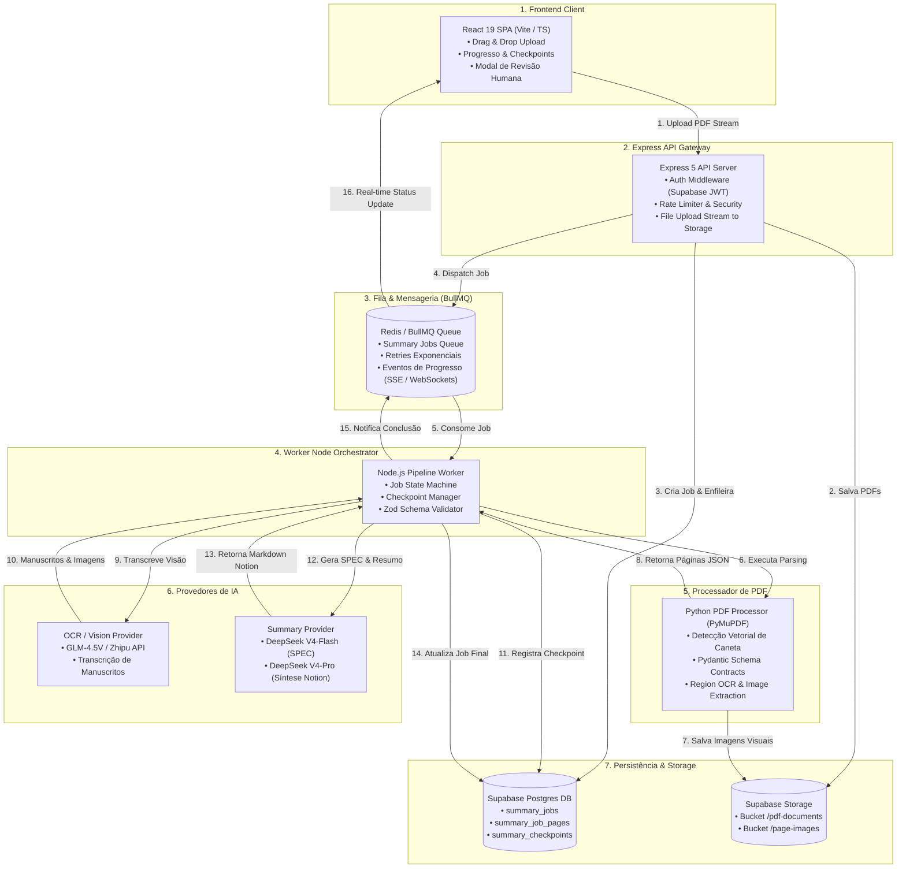

# Arquitetura-Alvo de IA e Pipeline de Resumos do ResumeX

> **Estado alvo, não runtime atual.** A adoção de Redis/BullMQ continua sem
> justificativa de carga e não deve ocorrer por padrão. O primeiro corte ativo é uma
> ponte opt-in de Supabase para resumos com um PDF. O Document IR já é validado nesse
> corte, assim como o provider final validado e `summary_versions`. Planning/vision
> V2, páginas/blocos/fontes e recuperação após restart permanecem pendentes.

Data: 24/07/2026
Versão: 2.0.0 (Comercial / Escala)

---

## 1. Visão Geral e Arquitetura-Alvo (Mermaid)

---

## 2. Componentes da Arquitetura-Alvo

### 2.1. Frontend Client
* **Upload Resiliente:** Upload de arquivos diretamente via presigned URLs para o Supabase Storage ou streaming chunked, exibindo progresso em tempo real por arquivo.
* **Modal de Revisão Humana:** Exibição interativa de trechos visuais ou manuscritos identificados com baixa confiança para confirmação antes da síntese final.
* **Leitor Notion-Ready:** Renderizador em Markdown com suporte a listas colapsáveis (`toggles`), blocos de alertas (`callouts`), tabelas e atalho para cópia imediata.

### 2.2. Express API Gateway
* **Autenticação:** Validação de tokens JWT do Supabase Auth no middleware `requireAuth`.
* **Desacoplamento Heavy Tasks:** A API não executa nenhuma etapa do pipeline no mesmo processo; apenas valida contratos via Zod, persiste o registro do job no Postgres e publica uma tarefa no BullMQ.

### 2.3. Queue & Mensageria (BullMQ / Redis)
* **Gerenciamento de Estado de Fila:** Isolamento de trabalhos por prioridade e concorrência configurável.
* **Estratégia de Retry:** Configuração de retries exponenciais com backoff (ex: 3 tentativas para chamadas de rede com IA).
* **Dead Letter Queue (DLQ):** Retenção de jobs com falhas fatais para análise técnica e telemetria sem perda de estado.

### 2.4. Node Orchestrator Worker
* **State Machine:** Transições estritas de estado (`queued` -> `processing_pdf` -> `vision_ocr` -> `extracting_spec` -> `awaiting_review` -> `synthesizing` -> `auditing` -> `completed`).
* **Checkpoints de Etapas:** Salva o progresso de cada página processada no banco de dados. Caso ocorra uma falha na fase de síntese, o worker reinicia a partir do último checkpoint sem repetir extração de PDF ou chamadas de visão.
* **Zod Contracts:** Toda resposta das chamadas de visão (GLM) e resumo (DeepSeek) é validada contra schemas Zod estritos.

### 2.5. Python PDF Processor
* **Detecção Vetorial Avançada:** Além de checar objetos `Ink` em `annots`, analisa o stream de gráficos vetoriais (`page.get_drawings()`) para identificar riscos a caneta, marca-textos e anotações feitas em apps como GoodNotes e Notability.
* **Pydantic Schemas:** Garantia de que a saída em JSON emitida para o Node siga um contrato tipado rigorosamente.
* **Segmentação por Bounding Box:** Mapeamento relativo normalizado `[x0, y0, x1, y1]` de todos os blocos de texto e imagem.

### 2.6. Provedores de IA (Adaptadores Decoplados)
* **Vision Provider (GLM-4.5V):** Leitura de anotações manuais, gráficos, tabelas e diagramas.
* **Summary Provider (DeepSeek V4 Flash / Pro):** Extração da SPEC técnica e geração do resumo estruturado.
* **Interface Única de Adaptação (`IAgentProvider`):** Permite substituir ou alternar modelos via configuração no servidor sem alterar a regra de negócio.

### 2.7. Persistência & Storage (Supabase Postgres & S3 Storage)
* **Tabela `summary_jobs`:** Armazena metadata, preferências, status, hashes SHA-256 e custo total.
* **Tabela `summary_job_pages`:** Registra o conteúdo nativo, blocos com coordenadas e transcrições visuais de cada página.
* **Tabela `summary_checkpoints`:** Histórico de progresso para retentativas de falhas sem custo duplicado.

---

## 3. Fluxo de Dados e Garantias de Qualidade

1. **Garantia de 100% de Cobertura:** Toda página sem exceção passa pela análise vetorial e visual do worker Python.
2. **Preservação de Anotações:** Anotações a caneta identificadas como legíveis são obrigatoriamente integradas no tópico correspondente do resumo sob o formato `(✍️ Manuscrito: [nota])`.
3. **Auditoria Integrada:** Validação determinística do conjunto de páginas citadas versus páginas com conteúdo substancial. Omissões resultam em injeção de trechos nas seções originais e não apenas anexos ao final.
