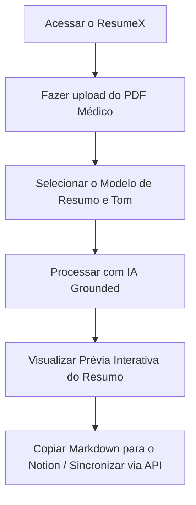

# Especificação do Projeto: ResumeX

**ResumeX** é um aplicativo web projetado para estudantes e profissionais de medicina. Ele simplifica o processo de transformar anotações, slides, capítulos de livros e artigos médicos (em formato PDF) em resumos perfeitamente estruturados e otimizados para o **Notion**. 

O foco central do ResumeX é a **fidelidade absoluta aos dados fornecidos** (grounding estrito), eliminando alucinações da IA e formatando o conteúdo de maneira nativa para o fluxo de trabalho do Notion (utilizando listas colapsáveis, callouts de destaque, tabelas e perguntas de recordação ativa).

---

## 1. Visão Geral e Proposta de Valor

Estudantes de medicina lidam com um volume massivo de informações densas diariamente. A transição de PDFs brutos para resumos estruturados no Notion costuma ser manual, demorada e exaustiva.

**A Solução ResumeX:**
- **Upload Simples:** O usuário arrasta um ou mais PDFs de conteúdo médico.
- **Resumos 100% Confiáveis:** A IA gera o resumo baseando-se *única e exclusivamente* no conteúdo do PDF, ignorando conhecimentos externos que possam induzir a erros ou alucinações em dosagens, diagnósticos e termos clínicos específicos.
- **Otimizado para o Notion:** O output gerado usa sintaxe Markdown avançada compatível com o Notion (como toggles, blocos de citação, listas e tabelas), permitindo copiar e colar com formatação perfeita ou sincronizar diretamente.

---

## 2. Público-Alvo e Casos de Uso

1. **Estudantes de Medicina:** Organização de matérias como Anatomia, Fisiologia, Farmacologia e Patologia no Notion para estudo ativo.
2. **Residentes Médicos:** Resumos rápidos de diretrizes clínicas (guidelines) longas e densas para consulta rápida no plantão.
3. **Médicos e Pesquisadores:** Consolidação de artigos científicos em bancos de dados de conhecimento médico pessoal no Notion.

---

## 3. Funcionalidades Principais (Core Features)

### 3.1. Upload e Extração de PDFs
- Suporte a múltiplos arquivos PDF (com limites configuráveis, ex: até 50MB ou 100 páginas).
- Processamento robusto de texto, tabelas e estruturas básicas de layout contidos no PDF.
- Indicador visual de progresso durante o upload e análise do arquivo.

### 3.2. Engine de IA com Grounding Estrito
Para garantir a segurança médica dos resumos, a IA utilizará a leitura de contexto completo aproveitando a janela gigante de **1 milhão de tokens** do **DeepSeek V4** (V4-Pro / V4-Flash). Isso elimina a necessidade de fragmentação complexa (RAG) para a maioria dos arquivos e garante que todo o material seja processado de uma única vez.
- **Diretriz de Alucinação Zero:** Se uma informação não estiver explicitamente no PDF, a IA não deve inventá-la ou complementá-la com dados externos, mesmo que sejam clinicamente corretos. O usuário precisa da síntese do *seu* material de estudo.
- **Rastreabilidade:** Possibilidade de citar a página ou seção do PDF original de onde a informação foi extraída.

### 3.3. Formatação Fiel ao Notion (Notion-Ready Output)
O output final em Markdown será projetado para ser copiado e colado diretamente no Notion, convertendo-se automaticamente em blocos ricos:
- **Toggles (`# > Pergunta` ou `- > Tópico`):** Para técnicas de *Active Recall* (recordação ativa) e *Spaced Repetition*.
- **Callouts (`> [!NOTE]` ou emojis):** Destaque de termos críticos, alertas clínicos, sinais de alerta (red flags) e mnemônicos.
- **Tabelas Markdown:** Para comparações de drogas, diagnósticos diferenciais e classificações clínicas.
- **Listas Aninhadas:** Para fluxos fisiológicos e etapas de tratamento.

### 3.4. Modelos (Templates) de Resumo Selecionáveis
O usuário poderá escolher como deseja estruturar o resumo no Notion:
1. **Método Cornell:** Divisão em Tópicos Chave, Notas Detalhadas e Sumário de Fixação.
2. **Recordação Ativa (Active Recall Q&A):** O material é transformado em um conjunto de perguntas colapsáveis (toggles) com as respostas dentro. Ideal para estudar antes de provas.
3. **Guia de Consulta Rápida (Cheat Sheet):** Resumo focado em tabelas comparativas, dosagens descritas no texto, diagnósticos diferenciais e critérios de escolha.
4. **Ficha Clínica Clássica:** Foco em Fisiopatologia, Quadro Clínico, Diagnóstico e Tratamento (baseado no PDF).

---

## 4. Jornada do Usuário (User Flow)



1. **Passo 1 (Upload):** O usuário entra em uma interface limpa com uma área de drag-and-drop para o PDF.
2. **Passo 2 (Configuração):** O usuário escolhe o template de estudo desejado (ex: *Active Recall*) e se deseja focar em termos mais técnicos ou explicações diretas.
3. **Passo 3 (Geração):** A tela mostra uma animação moderna de processamento.
4. **Passo 4 (Interação):** A tela divide-se: à esquerda, o PDF original; à direita, o resumo gerado com botões de "Copiar para o Notion", "Ajustar Resumo" e "Fazer pergunta sobre o PDF".

---

## 5. Arquitetura Técnica Proposta

### 5.1. Tech Stack Sugerida
- **Frontend:** React com Vite ou Next.js (SPA ou SSR de alta performance).
- **Estilização:** CSS Moderno (variáveis customizadas, layouts fluidos, suporte a dark mode automático).
- **Parser de PDF:** `pdfjs-dist` no client-side para extração rápida de texto, ou uma API serverless (Node.js/Python) usando `pdf-parse` / `PyPDF2`.
- **API de IA:** **DeepSeek API (DeepSeek V4-Pro ou V4-Flash)** (oferece excelente custo-benefício, forte capacidade de raciocínio médico estruturado e janela de contexto de 1 milhão de tokens, a uma fração do custo de modelos ocidentais equivalentes).

### 5.2. Arquitetura do Prompt (System Instructions)
Para garantir o grounding estrito, o prompt do sistema para a API do DeepSeek será desenhado da seguinte forma:

```text
Você é um assistente de medicina altamente preciso encarregado de resumir materiais acadêmicos para estudantes.
Seu objetivo é gerar um resumo formatado para o Notion baseado EXCLUSIVAMENTE no texto fornecido no contexto abaixo.

REGRAS CRÍTICAS:
1. Não utilize nenhum conhecimento externo sobre medicina para complementar o resumo. Se o texto diz que o tratamento para a doença X é Y, mencione Y, mesmo que diretrizes externas mais novas recomendem Z.
2. Se uma informação essencial estiver ausente ou confusa no texto original, não tente adivinhar. Omitir ou indicar [Informação não contida no documento original].
3. Formate a saída em Markdown usando a estrutura de blocos compatível com o Notion:
   - Use toggles (ex: `- **Pergunta?** <br> Resposta`) para facilitar o estudo ativo.
   - Use tabelas para comparações.
   - Use blocos de notas/citações para conceitos cruciais.
```

---

## 6. Design System & Estética (Premium UI)

O design deve passar confiança científica, profissionalismo e modernidade, afastando-se do visual "genérico" de ferramentas de IA.

- **Tema de Cores (Paleta Médica Moderna):**
  - *Fundo Dark:* Azul petróleo profundo (`#0d1527`), cinza escuro azulado (`#16223f`).
  - *Cores de Destaque:* Verde menta clínico/neon (`#00f5d4`), azul ciano (`#00bbf9`), roxo elétrico (`#7209b7`).
  - *Textos:* Branco suave (`#f8f9fa`) e cinza claro de apoio (`#a0aec0`).
- **Efeitos Visuais:**
  - Glassmorphic Cards (efeito de vidro fosco com blur no fundo).
  - Transições suaves (`transition: all 0.3s ease`).
  - Gradientes dinâmicos nas bordas dos cards e botões.
- **Tipografia:**
  - Fonte principal: *Inter* ou *Outfit* (Google Fonts) para alta legibilidade de termos médicos complexos.

---

## 7. Próximos Passos (Plano de Implementação Sugerido)

### Fase 1: MVP Local (Single Page Application)
- [ ] Criação do projeto React + Vite + CSS Customizado.
- [ ] Implementação da interface de upload e parser do PDF (extração de texto direto no navegador).
- [ ] Conexão com a API do DeepSeek via SDK oficial ou requisições HTTP diretas (usando chaves de teste).
- [ ] Geração do markdown básico formatado para Notion e botão de copiar.

### Fase 2: Backend & Segurança
- [ ] Migração das chamadas de IA para um backend seguro (Serverless Functions / Next.js API Routes).
- [ ] Tratamento avançado de PDFs escaneados (integração opcional com OCR).
- [ ] Sistema de templates avançados e controle de histórico de resumos.

### Fase 3: Integração Direta com Notion
- [ ] Integração com a API Oficial do Notion para permitir que o usuário crie a página diretamente em seu workspace com um clique.
